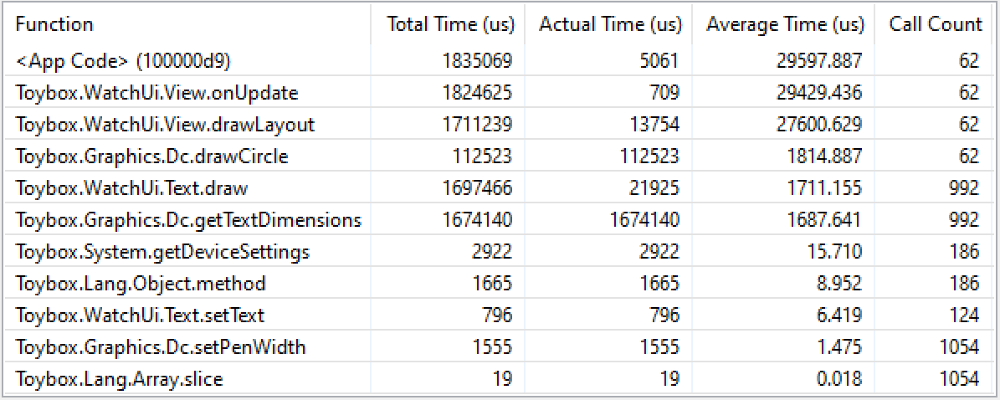
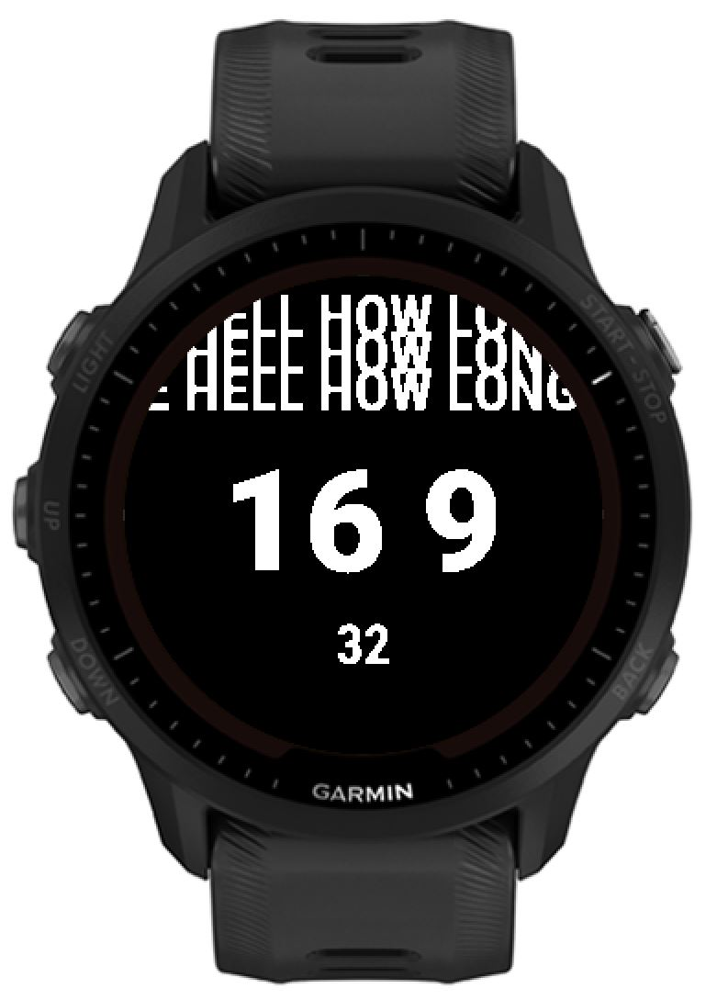

# Test of Garmin's layout system

In short, it's no good. This example renders text, same text, over and over, and it seems to linearily get worse more text you add.

In other words, the Layout engine in Garmin can't seem to buffer the text graphics and update only changes. What is the point of layout engine?

Here is one 62 second of profiling:

In above you see that OnUpdate gets called 62 times, once per second, yet it takes 10ms on average. Updating just the second should not take 10ms, it should be around 2ms.

You can also verify it's bad by just adding more static text. Which seems to make the on average time worse, even though it should be buffered if layout engine is well done.

## What the example looks like in emulator

## Test

1. Get Garmin SDK with [Garmin SDK Manager](https://developer.garmin.com/connect-iq/sdk/)
2. Open the project in VSCode, install recommended extensions.
3. Click on the VSCode's Start Debugging (in Launch), or F5

## License

Public domain or MIT License. What ever.
